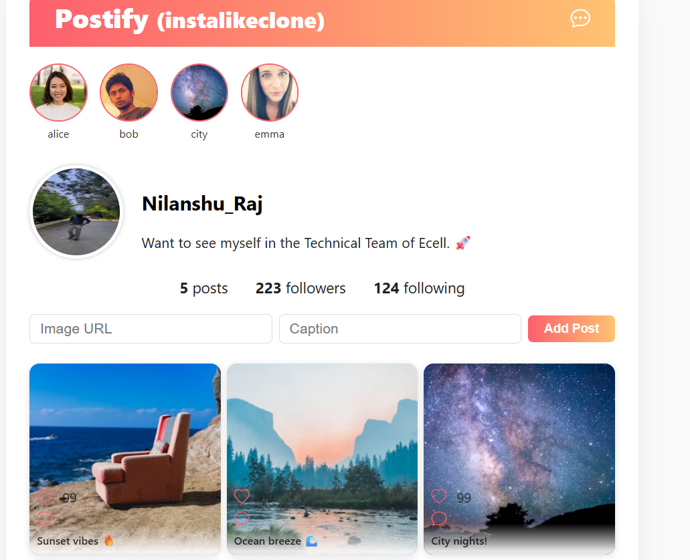

# Postify (instalikeclone)

A visually-rich, Instagram-inspired social media frontend built with React.  
Features stories, DMs (UI), a beautiful grid photo feed, user profile, and modern responsive design—perfect for demos, portfolios, and club recruitment.

---

## 🚀 Live Demo

[View Postify Live](https://insta-like-clone.netlify.app/)

---

## ✨ Features

- Modern navbar with branding and DM shortcut
- Stories bar with avatars
- User profile: circular avatar, bio, customizable stats
- Responsive, animated Instagram-style post grid
- Add new posts with an image URL and caption
- Fake DMs popup for demo-style instant messaging UI
- Modular React components, easy to maintain

---

## 📸 Screenshots
 
 

---

## 🏁 Quick Start

Clone and launch locally:

